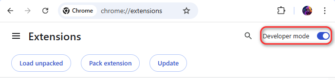
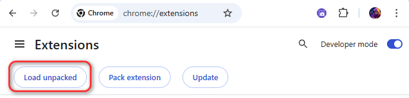
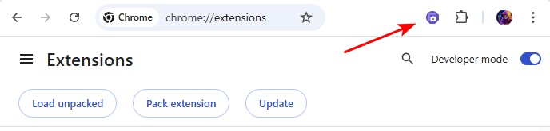
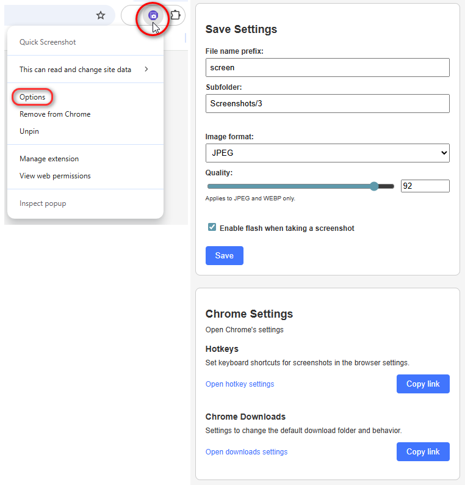

🌐 Доступні мови:  
[English](README.en.md) | [Русский](README.ru.md) | [Українська](README.uk.md) | [Nederlands](README.nl.md) | [Deutsch](README.de.md)

---

# QuickScreenshot
Розширення для Chrome, яке дозволяє швидко робити скріншоти.

---

## 🚀 Встановлення

### Крок 1. Завантажте розширення
Завантажте архів **QuickScreenshot.zip** і розпакуйте його у зручне місце на комп’ютері.

---

### Крок 2. Відкрийте сторінку розширень
1. Відкрийте Google Chrome.  
2. У рядку адреси введіть:  
   ```
   chrome://extensions
   ```
3. Увімкніть **Режим розробника** у верхньому правому куті.



---

### Крок 3. Встановіть розширення
1. Натисніть кнопку **"Завантажити розпаковане"**.  
2. Виберіть папку `QuickScreenshot`.  



---

### Крок 4. Готово!
Після встановлення розширення з’явиться у списку.  
Рекомендується закріпити іконку на панелі браузера для швидкого доступу.




---
## ⚙️ Доступ до налаштувань

Доступ до налаштувань програми натисканням правої кнопки миші.  
Всі шляхи відносно папки завантажень Google Chrome!



---

✅ Тепер ви можете користуватися QuickScreenshot!

---

🌐 Доступні мови:  
[English](README.en.md) | [Русский](README.ru.md) | [Українська](README.uk.md) | [Nederlands](README.nl.md) | [Deutsch](README.de.md)
